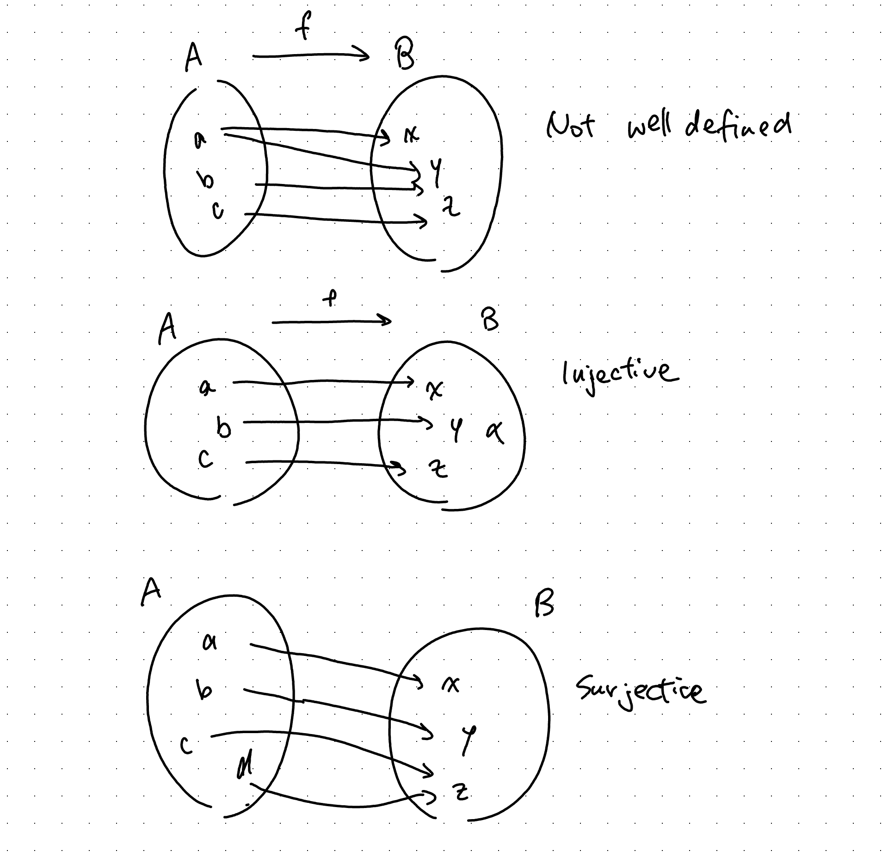

These are just personal reminders for how I'm formatting/shortcuts/etc. Feel free to use this for reference as well.

# Quarto markdown

## Links

`[Text shown](path)` - for linking pages

- `../file-name.qmd` - if the file is in a previous folder
- `../../file-name.qmd` - if the file is in two folders back and etc

`[Text shown](url)` - for external links

`[Text shown](url){target="_blank"}` - for external links and open in a new tab

[Wikipedia - same tab](https://en.wikipedia.org/wiki/Main_Page)

[Wikipedia - new tab](https://en.wikipedia.org/wiki/Main_Page){target="_blank"}

## Images

`{#image-0.1}` - "image-caption" will show up underneath the image, may be empty

{#image-0.1}

Checking if labelling is working: look at [Functions](#image-0.1).

# Formatting

`#` for chapters, `##` for subchapters

## Callouts

Use callouts for definitions, results, examples, proofs, etc. Each must be labelled with `#type-number`, type is just the name of the type of result or other. e.g Definition would have type 'definition'.

::: {#definition-0.1 .callout-tip}
## Definition 0.1 - Functions
Definition of function goes here.
:::
```
::: {#definition-0.1 .callout-tip}
## Definition 0.1 - Functions
Definition of function goes here.
:::
```
- Definitions
- Notation
- Axioms

::: {#theorem-0.1 .callout-note}
## Theorem 0.1 - Green's Theorem
Green's Theorem goes here.
:::
```
::: {#theorem-0.1 .callout-note}
## Theorem 0.1 - Green's Theorem
Green's Theorem goes here.
:::
```
- Theorems
- Propositions
- Corollaries
- Lemmas
- Remarks

::: {#example-0.1 .callout-warning}
## Example 0.1
The integers under addition is a group.
:::
```
::: {#example-0.1 .callout-warning}
## Example 0.1
The integers under addition is a group.
:::
```
- Examples

::: {#answer-0.1 .callout-important collapse=true}
## Answer
We show that the integers under addition is a group using the group definition.
:::
```
::: {#answer-0.1 .callout-important collapse=true}
## Answer
We show that the integers under addition is a group using the group definition.
:::
```
- Proofs
- Answers

::: {#prerequisite-page .callout-caution collapse=true}
## Prerequisites
- Set notation
:::
```
::: {#prerequisite-page .callout-caution collapse=true}
## Prerequisites
- Set notation
:::
```
- Prerequisites (to the page) -> prq
- Hints -> hint

Checking that the linking works. Look at [the first definition](#definition-0.1).

## Numbering

- Defining multiple terms in one definition callout; 1., 2., 3., etc

- One term has multiple conditions to be defined; (i), (ii), (iii), etc

- Multiple results in one result callout; (a), (b), (c), etc

- Multiple conditions for a result; (i), (ii), (iii), etc

\(i\) Note that for these styles of lists

\(ii\) Quarto automatically makes them into say ii.

\(a\) Use backslashes before each bracket to make sure I get the brackets

\(b\) i.e. use `\(b\)`

## Linking

When introducing notation for a definition, the defined word/phrase/other will not be linked.

If I need to reference a result on a different page the shown text will be "Page Name - Result ##". If I am referencing a result in the same page, it will just be "Result ##".

I will be linking every first instance of terminology in a callout and when I think it's important.

No links in the callout title.

A lot of 'basic' terms won't be linked unless it is the subject of the sentence/section.

If I haven't yet made a page/section about something I reference, it'll lead to the construction page (`construction.qmd`).

::: {.callout-caution collapse=false}
## List of "basic terms"
- Set
- Element
- Subset
- Set of numbers
- Intersect/Union
- Contradict/absurd
- Statement
- Direct proof
- Function/map
- Domain
:::


